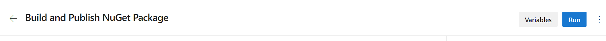
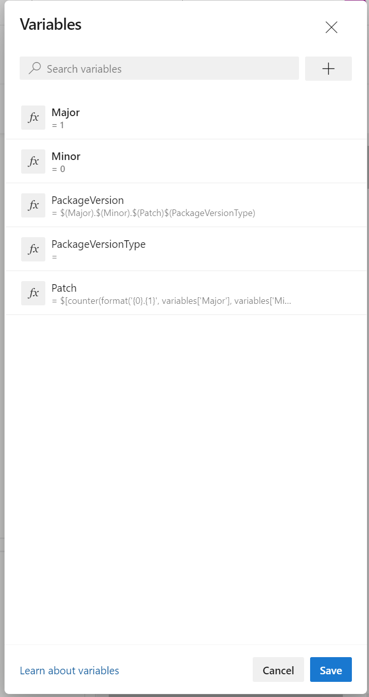

# Publishing NuGet Packages to Azure Artifacts from Azure Pipelines

This repository contains a simple .Net Core class library and a pipeline that demonstrates building the library, creating a NuGet package and publishing the package to Azure Artifacts with somewhat automatic version management.

## Creating the NuGet Package
The following pipeline task creates the NuGet package:

``` yaml
          - task: DotNetCoreCLI@2
            inputs:
              command: pack
              packagesToPack: '**/*.csproj'
              versioningScheme: byEnvVar
              versionEnvVar: 'PackageVersion'
              arguments: '--configuration $(buildConfiguration) --output $(Build.ArtifactStagingDirectory)
```
Note the inputs `versioningScheme` and `versionEnvVar`, these are key to how the version gets set on the NuGet package.  The `versioningScheme` value, `byEnvVar` tells the `pack` command to source the value for the version number from an environment variable named `PackageVersion`.  In this case, `PackageVersion` is a pipeline variable.  The mechanics of this variable are described below.

## Publishing the NuGet Package
The following pipeline tasks publish the NuGet package to an Azure Artifacts NuGet feed:

``` yaml
          - task: NuGetAuthenticate@0
            displayName: 'Authenticate to NuGet Feed'
          
          - task: NuGetCommand@2
            displayName: 'NuGet push'
            inputs:
              command: push
              packagesToPush: '$(Pipeline.Workspace)/NuGet/*.nupkg'
              publishVstsFeed: '$(ProjectName)/$(FeedName)'
```

The first command authenticates to Azure Artifacts.  The second command publishes the package to the feed.  For the `publishVstsFeed` input value, set `$(ProjectName)` to the name of the project that hosts your feed and `$(FeedName)` to the name of your NuGet feed.

## Version Management
Versioning of NuGet packages using the approach demonstrated in this pipeline relies on several pipeline variables.  The following table lists those variables and their initial values.

|Variable Name|Description|Initial Value|
--------------|-----------|-------------|
|Major|The major version number for your package, following SemVer semantics|1, or any major version number you wish to begin at|
|Minor|The minor version number for your package, following SemVer semantics|0, or any minor version number you wish to start at|
|PackageVersion|This value will be used in the pipeline to provide the version number used on when your NuGet package is created.  The expression provided in the Initial Value column should not be changed|`$(Major).$(Minor).$(Patch)$(PackageVersionType)`|
|PackageVersionType|Use this variable if you want to create a pre-release version of your package.  Set it to `-alpha`, `-beta`, `-rc` or whatever identifier you want to use to indicate the package is pre-release.  Note the value of this variable *MUST* begin with a `-` (hyphen)|Leave blank for non pre-release, otherwise set the approrpiate suffix, remembering the value must begin with a hyphen|
|Patch|The patch version number for your package, following SemVer semantics.  Note the value of this variable uses an expression based on the `counter()` expression.  This expression maintains a stateful counter that will increment automatically each time your pipeline runs until either the `Major` or `Minor` variables are changed.  If either `Major` or `Minor` are changed, the value of this variable will automatically reset to zero, then begin incrementing on subseuent pipeline runs.  The expression provided in the Initial Value should not be changed.|`$[counter(format('{0}.{1}', variables['Major'], variables['Minor']), 0)]`

### Creating the Variables
These variables should be defined at the pipeline level so that they are persisted across pipeline runs.  To create the variables, in the Azure Pipelines Editor, click the `Variables` button at the top right of the editor:


When you've created your variables, you should see something that looks like this:


### Updating Major and Minor Version Numbers

As mentioned abovie, updating either the `Major` or `Minor` version variables causes the `Patch` variable to reset to zero.  There are two possible approaches to updating these variables, however only one will result in the desired behavior for automatically incrementing and resetting the `Patch` variable, so it is important you follow the correct approach.  To correctly update either `Major` or `Minor`, you **must** edit the pipeline definition in Azure DevOps and make the change by clicking the `Variables` button at the top right of the screen in the pipeline editor.  Edit your pipeline definition, click the `Variables` button, make the necessary changes to `Major` and/or `Minor`, then click `Save` to dismiss the `Variables` dialog.  From there you can either click `Run` to initiate a pipeline run using the new value(s) or wait for a triggered run of your pipeline from a PR/commit.

It is also possible to update pipeline variables when you manually run a pipeline in Azure Pipelines.  It is important that you do not update `Major` or `Minor` using this approach.  Doing so does not persist the values for future pipeline runs and will result in the automatic incrementing of the `Patch` parameter not behaving as expected.